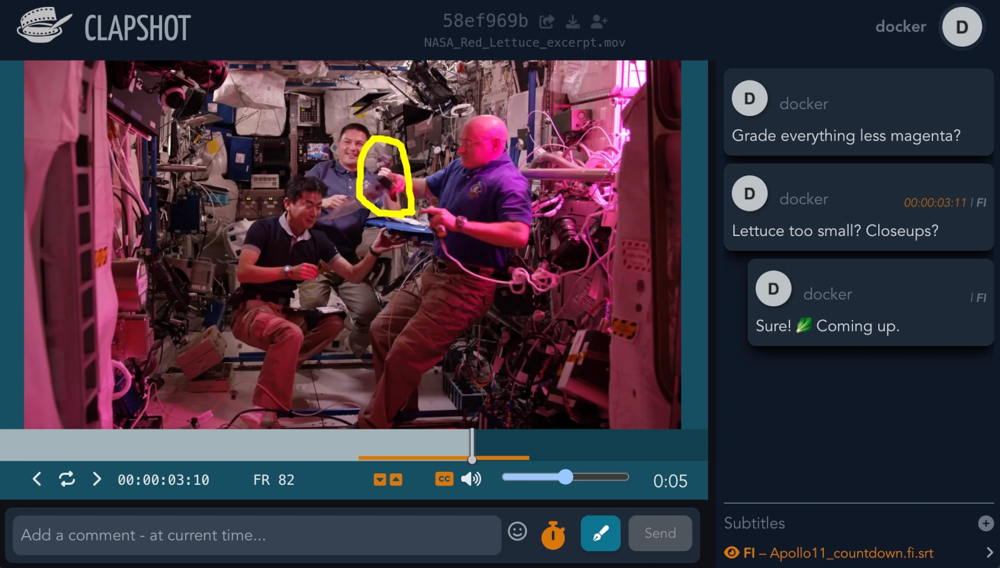
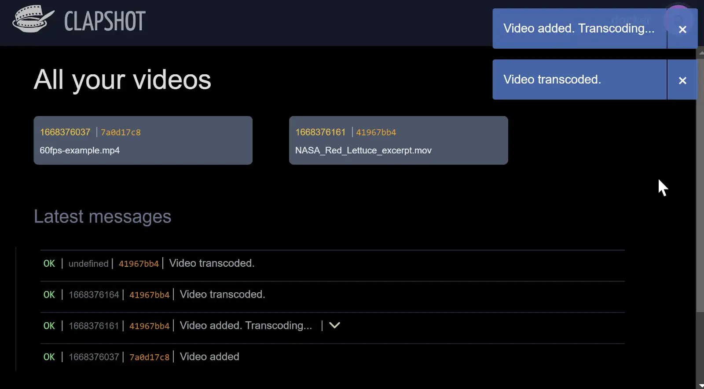

# Clapshot: Self-Hosted Video Review Tool
[]() [](https://github.com/elonen/clapshot/actions/workflows/docker-test.yml)

## Overview

Clapshot is an open-source, self-hosted tool for collaborative video review and annotation. It features a Rust-based API server and a Svelte-based web UI. This tool is ideal for scenarios requiring local hosting of videos due to:

1. Policy constraints (*enterprise users*), or
2. Cost-benefit concerns against paid cloud services (*very small businesses*)



### Key Features

- Video ingestion by HTTP video uploads, or shared folders
- Video transcoding with FFMPEG
- Commenting, drawing annotations, and threaded replies
- Real-time collaborative review sessions
- Storage of videos as files, and metadata in an SQLite (3.5+) database
- Authentication agnostic, you can use *OAuth, JWS, Kerberos, Okta* etc., using Nginx username passthrough
- **[NEW]** Extensible "Organizer" plugins for custom integrations, workflow, and access control

### When not to use Clapshot

If you don't require local hosting, or are not adept in networking and Linux, consider commercial cloud services which may offer more user-friendly interfaces and additional features out of the box.



## Demo

**Quick Start with Docker:**

- **Single-user demo:** No authentication

```bash
  docker run --rm -it -p 0.0.0.0:8080:80 -v clapshot-demo:/mnt/clapshot-data/data \
    elonen/clapshot:latest-demo
```

- **Multi-user demo** with HTTP basic auth, append `-htadmin`, i.e.: ...´elonen/clapshot:latest-demo-htadmin`

After the Docker image starts, access the web UI at `http://127.0.0.1:8080`.

The basic auth multi-user demo uses [PHP htadmin](https://github.com/soster/htadmin) for user management. Default credentials are shown in terminal.

These Docker images are demos only and *not meant for production*.

Here's a better way to deploy the system:

## Simplified Small-Business Deployment

For a simple production setup with password authentication on a Debian 12 host:

1. Prepare a Debian 12 with a mounted block device (or just directory) at `/mnt/clapshot-data`.
2. Download [Clapshot Debian Bookworm Deployment Script](https://gist.github.com/elonen/80a721f13bb4ec1378765270094ed5d5) and edit it to customize your access URL
3. Run the script as root to install and auto-configure Clapshot.
4. **!! Change the default admin password and delete example users in Htadmin !!**

## Configuration and Operation

See the [Sysadmin Guide](doc/sysadmin-guide.md) for information on

- configuring Nginx reverse proxy (for HTTPS and auth)
- using *systemd* for process management
- performing database migrations
- implementing advanced authentication methods
- building manually and running unit tests

## Architecture Overview

Main components:

- **Clapshot Client** – Single Page Application (SPA) that runs in the browser. Connects to Clapshot Server via Websocket. Written in *Svelte*.
- **Clapshot Server** – Linux daemon that handles most server-side logic. Binary written in *Rust*. Listens on `localhost` to the reverse proxy for plaintext HTTP and WSS.
- **Clapshot Organizer(s)** – Plugin(s) that organize videos and UI, to a custom folder hierarchy etc. Written in in *Python* (or any other language). See below for details.

Production deployments also depend on:

- **Web Browser** – Chrome works best. Loads and shows the Client.
- **Nginx Web Server** – SSL reverse proxy between Client and Server + static asset delivery for browser. Also routes session auth to Authentication Proxy.
- **Authentication Proxy** – Some auxilliary HTTP daemon that auths users and return a **user id** and **username** in HTTP headers. In the demo this is `/var/www/.htpasswd` + [PHP htadmin](https://github.com/soster/htadmin), but you can also use combinations like [Okta](https://www.okta.com/) + [Vouch](https://github.com/vouch/vouch-proxy) + [LDAP Authz Proxy](https://github.com/elonen/ldap_authz_proxy) or something equally advanced.
- **Sqlite DB** – Stores video metadata, comments, user messages etc. Both Clapshot Server and Organizer(s) access this. This is just a file, not a daemon.
- **ffmpeg** and **mediainfo** – Clapshot Server processes video files with commands.
- **File System** – Video files, HTML, JavaScript, CSS, thumbnail images etc, also `clapshot.sqlite`.

See [sequence diagram](doc/generated/open-frontpage-process.svg) for details on how these interact when a user opens the main page.

## Organizer Plugin System (New in 0.6.0):
Clapshot now includes an extensible [Organizer Plugin system](doc/organizer-plugins.md). Organizer can implement custom UIs, virtual folders, enforce access control based on your business logic, and integrate with existing systems (LDAP, project management databases, etc).

Organizers use gRPC to communicate with the Clapshot Server, and can be implemented in any language.

### Work In Progress

The [Organizer API](protobuf/proto/organizer.proto) is still evolving, so you are invited to **provide feedback** and discuss the future development, but please **do not expect backwards compatibility** for now.

## Development Setup

The [development setup guide](doc/development-setup.md) covers setting up the server and client development environments, and running local builds and tests.

## Contributions

Contributions are welcome, especially for features and improvements that benefit the wider user base. Please add your copyright notice for significant contributions.

## Licensing

Copyright 2022 – 2024 by Jarno Elonen

- Clapshot Server and Client are licensed under the **GNU General Public License, GPLv2**.
- gRPC/proto3 libraries and example organizer plugins are under the **MIT License**.

This split licensing allows you to implement proprietary UIs and workflows through custom Organizer plugins without releasing them to the public.
