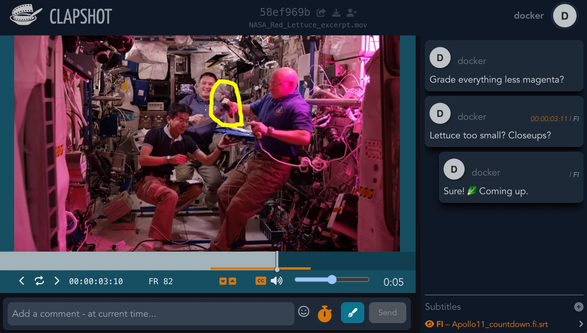
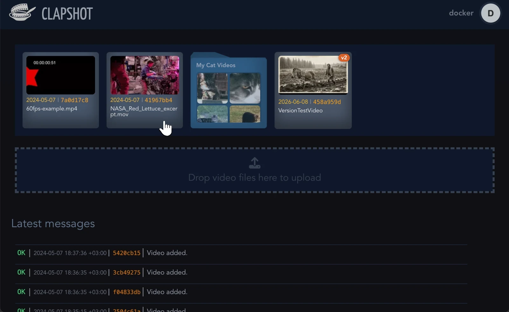

# Clapshot: Self-Hosted Video/Media Review Tool
[]() [](https://github.com/elonen/clapshot/actions/workflows/docker-test.yml)

## Overview

Clapshot is an open-source, self-hosted tool for collaborative video/media review and annotation.
Mainly for organizations that can't or won't put their media in commercial cloud services.



### Key Features

- **Media Support**: Video, audio and image files with subtitle track management
- **Ingestion**: HTTP uploads with progress tracking, or monitored folder processing (files assigned by OS ownership)
- **Video Player**: Loop region control (i/o shortcuts), frame-by-frame navigation, comprehensive keyboard shortcuts
- **Collaborative Review**: Real-time synchronized playback, drawing annotations with 7-color palette, threaded comments
- **Professional Tools**: EDL import as time-coded comments, drawing undo/redo, timeline comment pins
- **File Organization**: Hierarchical folder system with drag-and-drop, admin user management interface
- **Media Processing**: FFmpeg transcoding with configurable quality, thumbnail generation
- **Authentication**: Reverse proxy integration supporting OAuth, JWT, Kerberos, SAML, etc.
- **Storage**: SQLite database with automatic migrations, file-based media storage
- **Extensibility**: Plugin system for custom workflows and integrations

*For a comprehensive feature list, see [FEATURES.md](FEATURES.md).*



### When not to use Clapshot

If you don't require local hosting, or are not adept in networking and Linux, consider commercial cloud services. They'll offer more user-friendly interfaces and additional features out of the box.

## Demo

**Quick Demo with Docker**.

Local **single-user demo** without authentication

```bash
docker run --rm -it -p 0.0.0.0:8080:80 -v clapshot-demo:/mnt/clapshot-data/data elonen/clapshot:latest-demo
```

After the Docker image starts, browse the web UI at `http://127.0.0.1:8080`.

Local **multi-user demo** with a login form

```bash
docker run --rm -it -p 0.0.0.0:8080:80 -v clapshot-demo-htwicket:/mnt/clapshot-data/data elonen/clapshot:latest-demo-htwicket
```

Passwords are printed on console.

> **⚠ Demo images are for evaluation only — don't run them for anything serious.**
> See **[Deploying Clapshot](deploy/README.md)** for more info.

<details><summary>Tips for testing it</summary>

- Upload video/audio/image files via the web interface, or drop files into the container's `/mnt/clapshot-data/data/incoming/` directory for automatic processing
- Try the keyboard shortcuts: spacebar (play/pause), `i`/`o` (set loop points), `l` (toggle loop), arrow keys (frame stepping), `f` for fullscreen.

The multi-user demo uses [HTWicket](https://github.com/elonen/htwicket) for login and user management. Default credentials (including the randomly generated `admin` password) are shown in the terminal.

</details>

> **Note:** Chrome / Chromium-based browsers work best. If accessing from a different machine, configure the `CLAPSHOT_SERVER__URL_BASE` environment variable (or legacy `CLAPSHOT_URL_BASE`). See the [Quick Start Reference](doc/quick-start-reference.md) for common deployment scenarios.


### Known Limitations and Workarounds

- **Mobile Browsers:** Mobile/iOS/iPad support is limited. Chrome/Chromium (desktop) recommended.
- **Authentication:** The bundled HTWicket is a simple example — fine for small deployments, but for larger production use you may prefer to integrate a modern identity provider (OAuth, LDAP, Kerberos, SAML, etc.) via reverse proxy. See [Advanced Authentication](doc/sysadmin-guide.md#advanced-authentication).
- **IIS and Cloudflare:** IIS has a hard 2GB upload limit; Cloudflare's free tier times out uploads at ~100 seconds. For large files, you can use [monitored folder ingestion](doc/sysadmin-guide.md#monitored-folder-ingestion) (SFTP/SMB) instead of HTTP uploads. Self-hosted Nginx (also in the Docker images) has no such limitations.


## Deploying for Real Use

Two supported, maintainable paths — pick by your platform. (For the full overview, see
**[Deploying Clapshot](deploy/README.md)**.)

> **AUTH NEWS**: [HTWicket](https://github.com/elonen/htwicket) has replaced **htadmin** as the example auth provider for Clapshot. It's compatible with htadmin's `.htpasswd` files, doesn't need PHP, provides better logout, and is able to transparently upgrade password hashes to use more secure algorithms.

### 1. Docker Compose

Deploy a [Compose recipe](deploy/compose/) straight from this repo. Each recipe is **one
directory you deploy as-is**; [Caddy](https://caddyserver.com/) terminates TLS and fetches
**Let's Encrypt** certificates automatically. Pick by how you authenticate users:

- **[`htwicket/`](deploy/compose/htwicket/)** — Basic login form + user manager. Fine for simple deployments.
- **[`custom-proxy/`](deploy/compose/custom-proxy/)** — Clapshot behind *your* SSO identity provider (Authentik, Okta, Keycloak, Kerberos/AD, …)

(A [`no-auth/`](deploy/compose/no-auth/) recipe is also available for no-login setups.)

Should works with plain `docker compose`, Portainer, Komodo etc. Upgrades are `git pull` + redeploy.
See [deploy/compose/README.md](deploy/compose/README.md) for more info.

### 2. Linux VM / bare-metal → Debian package + systemd

The right choice when you already manage a VM and prefer packages to containers.

There's a one-shot install script [install-clapshot-deb.sh](deploy/debian/install-clapshot-deb.sh), that sets up Clapshot + HTWicket auth on a pristine Debian 12/13 host. You can either run it or follow it manually.

<details><summary>Step-by-step: Debian 12/13 install</summary>

1. Prepare a Debian host with a mounted block device (or just directory) at `/mnt/clapshot-data`.
2. Download [Clapshot Debian Deployment Script](deploy/debian/install-clapshot-deb.sh)
3. Run the script as root to install and auto-configure Clapshot.
4. **!! Change/verify the `admin` password (the installer prints a generated one), and delete the example users in `/htwicket/admin` !!**

If you want to expose this to the Internet, you'll probably want to get HTTPS certificates with Let's Encrypt and use some reverse proxy to encrypt Clapshot traffic.

> **Security Note:** Monitored folder ingestion assigns files to users based on OS file ownership. Ensure file system permissions align with your intended user access model before enabling this feature.

</details>

### Exposing a quick demo to the Internet (not production)

To show Clapshot to someone over a temporary public URL — without DNS or certificates — the
[test/run-cloudflare.sh](test/run-cloudflare.sh) script starts the **single-container demo image**
behind a Cloudflare tunnel. This is a demo convenience, **not** a deployment: the container is the
all-in-one demo build and Cloudflare's free plan limits upload size/time. For real internet-facing
use, deploy a [Compose recipe](deploy/compose/) with `CADDY_CERT_DOMAIN` set (automatic Let's
Encrypt), or put the `.deb` install behind your own HTTPS proxy.

<details><summary>Step-by-step: Docker + Cloudflare tunnel (demo)</summary>

You'll run the demo container (binding a local directory for Clapshot data), then start Cloudflared
in another container to expose it over an HTTPS tunnel.

1. Download and read [test/run-cloudflare.sh](test/run-cloudflare.sh), then run it
2. Once satisfied about operation, move to a [Compose recipe](deploy/compose/) for a real, upgradeable deployment
3. **!! Change the default passwords (the `admin` password is generated and shown in the container log), and delete example users in `/htwicket/admin` !!**

</details>

## Configuration and Operation

**New to Clapshot?** Start with the [Quick Start Reference](doc/quick-start-reference.md) for common deployment scenarios.

**Need help?** Ask your favorite LLM to read [llms.txt](https://raw.githubusercontent.com/elonen/clapshot/refs/heads/master/llms.txt) and to follow the links for comprehensive configuration assistance.

See the [Sysadmin Guide](doc/sysadmin-guide.md) for information on:

- configuring Nginx reverse proxy (for HTTPS and auth)
- using *systemd* for process management
- performing database migrations
- implementing advanced authentication methods
- building manually and running unit tests


**Having connection issues?** See the [Connection Troubleshooting Guide](doc/connection-troubleshooting.md) for help with common deployment and connectivity problems.

See [Upgrading Guide](doc/upgrading.md) for instructions on installing a new release over an old one.

**Want to customize media processing?** See the [Transcoding and Thumbnailing Guide](doc/transcoding.md) for configuring hardware acceleration, custom encoders, and specialized processing workflows.

**Using Slack?** An optional [Slack unfurl bot](extras/clapshot-slack-unfurl/) is available in `extras/` — it runs alongside Clapshot and shows rich link previews (thumbnail, title, timecode) when Clapshot URLs are posted in Slack channels.


## Architecture Overview

**Core:** Clapshot Client (browser, connects via WebSocket) · Clapshot Server (Rust daemon) · Clapshot Organizer(s) (plugins in Python or any language).

**Also needs:** Nginx (TLS reverse proxy) · Authentication Proxy · SQLite DB · FFmpeg + Mediainfo · File system.

<details><summary>What each component does</summary>

Main components:

- **Clapshot Client** – Single Page Application (SPA) that runs in the browser. Connects to Clapshot Server via Websocket. Written in *Svelte*.
- **Clapshot Server** – Linux daemon that handles most server-side logic. Binary written in *Rust*. Listens on `localhost` to the reverse proxy for plaintext HTTP and WSS.
- **Clapshot Organizer(s)** – Plugin(s) that organize media files into a custom folder hierarchy, etc. Written in Python (or any other language). See below for details.

Production deployments also depend on:

- **Web Browser** – Chrome/Chromium recommended for best compatibility. Loads and shows the Client.
- **Nginx Web Server** – SSL reverse proxy between Client and Server + static asset delivery for browser. Also routes session auth to Authentication Proxy.
- **Authentication Proxy** – Any auxiliary HTTP daemon that authenticates users and returns a **user id** and **username** in HTTP headers. In the demo, this is [HTWicket](https://github.com/elonen/htwicket) managing `/var/www/.htpasswd`, but you can also use combinations like [Okta](https://www.okta.com/) + [Vouch](https://github.com/vouch/vouch-proxy) + [LDAP Authz Proxy](https://github.com/elonen/ldap_authz_proxy) or something equally advanced.

- **Sqlite DB** – Stores metadata, comments, user messages etc. Both Clapshot Server and Organizer(s) access this. This is just a file, not a daemon.
- **ffmpeg** and **mediainfo** – Clapshot Server processes media files with these commands.
- **File System** – Media files, HTML, JavaScript, CSS, thumbnail images etc, also `clapshot.sqlite`.

</details>

See [sequence diagram](doc/generated/open-frontpage-process.svg) for details on how these interact when a user opens the main page.

## Organizer Plugin System

Clapshot includes an extensible [Organizer Plugin system](doc/organizer-plugins.md) that enables custom workflows and integrations. Organizers use gRPC communication and can be implemented in any language.

<details><summary>More on Basic Folders and its Metaplugins</summary>

The included "[basic_folders](organizer/basic_folders/README.md)" organizer (Python) provides:
- **Hierarchical Folders**: Personal folder structures for organizing media files
- **Folder Sharing**: Token-based sharing of folder contents (still requires authentication to access)
- **[Version Sets](doc/version-sets.md)**: Group revisions of a media file into one item and switch versions in the player
- **Admin Interface**: User management with batch operations and ownership transfer
- **Metaplugin extensions**: Easier extension in Python:

### Customization with Basic_Folders Metaplugins

**NEW: Add custom functionality by dropping a single Python file into `/opt/clapshot-org-bf-metaplugins`** – no need to modify core code or deal with gRPC protocol directly. Example use cases:

- **Add custom popup menu actions** to folders and media files (e.g., "Auto-subtitle", "Export to archive", "Send to review")
- **Implement custom workflows** and business logic specific to your organization (e.g. video rename, ownership transfer, auto-folders)
- **Integrate with external systems** (databases, LDAP, version controls, APIs) for authorization or processing
- **Modify the UI dynamically** based on user roles, folder properties, or file metadata
- **Run background process** such as automatic video expiration and trashing

This approach is **easier to develop** and **more robust against upgrades** than modifying core code or writing a full custom Organizer (if you're fine with Python). See [METAPLUGINS.md](organizer/basic_folders/METAPLUGINS.md) for complete documentation and a [working example](organizer/basic_folders/example_metaplugins/calculate_sha256.py).

</details>

## Development Setup

The [development setup guide](doc/development-setup.md) covers setting up the server and client development environments, and running local builds and tests.

**Translating the UI?** Clapshot uses a single gettext-based catalog shared by the server, organizer and client. See [i18n/README.md](i18n/README.md) for how to mark strings and add or update translations.

## Contributions

Contributions are welcome, especially for features and improvements that benefit the wider user base. Please add your copyright notice for significant contributions.

### Contributors

  - **Original Chinese (Simplified) translations** – Mike-Solar

## Licensing

Copyright 2022 – 2026 by Jarno Elonen and contributors

- Clapshot Server and Client are licensed under the **GNU General Public License, GPLv2**.
- gRPC/proto3 libraries and example organizer plugins are under the **MIT License**.

This split licensing allows you to implement proprietary UIs and workflows through custom Organizer plugins without releasing them to the public.
