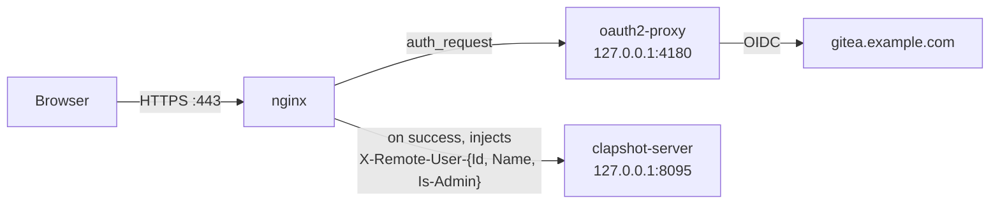

# Auth example: Gitea (OIDC) + oauth2-proxy

A concrete example of Clapshot's [Advanced Authentication](sysadmin-guide.md#advanced-authentication)
model: authenticate against a **Gitea** instance as an OpenID Connect (OIDC) identity
provider, using [**oauth2-proxy**](https://github.com/oauth2-proxy/oauth2-proxy) as an
nginx `auth_request` gateway.

Gitea **org** membership gates who may
log in, and Gitea **team** membership decides who is a Clapshot admin — managed entirely in
Gitea's UI, with no Clapshot-side user list.

Throughout, substitute your own hostnames for `clapshot.example.com` (Clapshot) and
`gitea.example.com` (Gitea), and your own Gitea org/team for `mediateam` / `clapshot-admins`.

## How it fits together



- **Login** is gated to members of Gitea org **`mediateam`**.
- **Admins** are members of team **`clapshot-admins`** in that org. Gitea emits org/team
  membership as `org` and `org:team` strings, so this team appears as the group
  `mediateam:clapshot-admins`, which an nginx `map` turns into `X-Remote-User-Is-Admin: true`.
- **User id** is the Gitea login (`preferred_username`).

This example uses a `.deb` install (bare nginx). It applies equally to the Docker
[`custom-proxy`](../deploy/compose/custom-proxy/) recipe — run oauth2-proxy + this nginx
`auth_request` logic as the front proxy that sets `X-Remote-User-*`, and point it at the
recipe's stack.

## Prerequisites

- Clapshot server + client installed behind nginx (see [sysadmin-guide.md](sysadmin-guide.md)).
- **Gitea ≥ 1.19** instance (version that `groups` scope began returning org/team).
- A TLS certificate for `clapshot.example.com`.
- The `oauth2-proxy` binary ([releases](https://github.com/oauth2-proxy/oauth2-proxy/releases)).

## 1. Register an OAuth2 application in Gitea

Gitea → *Settings → Applications → Create OAuth2 Application* (or *Site Administration →
Applications* for an instance-wide one):

- **Redirect URI:** `https://clapshot.example.com/oauth2/callback`
- Copy the generated **Client ID** and **Client Secret**.

Then model your org/teams: create org **`mediateam`** and add every Clapshot user to it
(this gates login); create team **`clapshot-admins`** in that org and add your admins.
No other Gitea config is needed — the `groups` scope returns org/team automatically.

## 2. oauth2-proxy

`/etc/oauth2-proxy/oauth2-proxy.cfg` (mode `0640`, it holds secrets):

```ini
provider        = "oidc"
oidc_issuer_url = "https://gitea.example.com"   # must equal the "issuer" in
                                                # https://gitea.example.com/.well-known/openid-configuration
client_id     = "REPLACE_WITH_GITEA_CLIENT_ID"
client_secret = "REPLACE_WITH_GITEA_CLIENT_SECRET"
redirect_url  = "https://clapshot.example.com/oauth2/callback"

# Ask Gitea for org/team membership.
scope             = "openid profile email groups"
oidc_groups_claim = "groups"

# Gate LOGIN to org "mediateam" (any team). Delete to allow any Gitea user;
# admin is still decided separately by the nginx map on team membership.
allowed_groups = [ "mediateam" ]
email_domains  = [ "*" ]                          # Gitea always issues an email

set_xauthrequest     = true    # expose X-Auth-Request-{Preferred-Username,Groups} to nginx
skip_provider_button = true    # go straight to Gitea instead of an interstitial button

# Behind nginx; it does the real proxying, so the upstream is just a stub.
reverse_proxy = true
http_address  = "127.0.0.1:4180"
upstreams     = [ "static://200" ]

# IMPORTANT: strip the raw Gitea tokens from the cookie (keep user/email/groups).
# Gitea's id_token + the groups claim otherwise pushes the session past the 4kb
# single-cookie limit, splitting it into _clapshot_oauth2_0/_1 and causing redirect
# loops. Safe because we don't pass tokens upstream or refresh them.
session_cookie_minimal = true

cookie_name   = "_clapshot_oauth2"
cookie_secure = true
cookie_secret = "REPLACE_ME"                      # openssl rand -base64 32 | tr -- '+/' '-_'
```

Run it under systemd — `/etc/systemd/system/oauth2-proxy.service`:

```ini
[Unit]
Description=oauth2-proxy for Clapshot (Gitea OIDC)
After=network-online.target
Wants=network-online.target

[Service]
User=oauth2-proxy
Group=oauth2-proxy
ExecStart=/usr/local/bin/oauth2-proxy --config=/etc/oauth2-proxy/oauth2-proxy.cfg
Restart=on-failure
NoNewPrivileges=true
ProtectSystem=strict
ProtectHome=true
PrivateTmp=true

[Install]
WantedBy=multi-user.target
```

```sh
sudo useradd --system --no-create-home --shell /usr/sbin/nologin oauth2-proxy
sudo install -d -m0755 /etc/oauth2-proxy
sudo install -m0640 -o root -g oauth2-proxy oauth2-proxy.cfg /etc/oauth2-proxy/oauth2-proxy.cfg
sudo sed -i "s|REPLACE_ME|$(openssl rand -base64 32 | tr -- '+/' '-_')|" /etc/oauth2-proxy/oauth2-proxy.cfg
sudo systemctl enable --now oauth2-proxy
```

## 3. nginx: authenticate, then inject identity headers

The important parts of the nginx server block. The `map` (in the `http` context) is what
turns Gitea team membership into Clapshot admin:

```nginx
# Gitea emits "org" and "org:team"; nginx joins multiple values with ", ".
# Admins = members of team "clapshot-admins" in org "mediateam".
map $auth_groups $clapshot_is_admin {
    default                                          "false";
    "~(?:^|,\s*)mediateam:clapshot-admins(?:\s*,|$)" "true";
}

server {
    listen 443 ssl;
    http2 on;
    server_name clapshot.example.com;

    ssl_certificate     /etc/ssl/private/clapshot.example.com.crt;
    ssl_certificate_key /etc/ssl/private/clapshot.example.com.key;

    underscores_in_headers off;      # drop client X_Remote_User_* spoofs
    client_max_body_size 50G;
    large_client_header_buffers 4 16k;   # tolerate a split session cookie

    # Health check MUST stay unauthenticated (the client probes it).
    location /api/health { proxy_pass http://127.0.0.1:8095/api/health; }

    # oauth2-proxy public endpoints (sign_in / callback / sign_out).
    location /oauth2/ {
        proxy_pass       http://127.0.0.1:4180;
        proxy_set_header Host                    $host;
        proxy_set_header X-Real-IP               $remote_addr;
        proxy_set_header X-Forwarded-Proto       $scheme;
        proxy_set_header X-Auth-Request-Redirect $request_uri;
        proxy_buffer_size 16k; proxy_buffers 4 16k;   # buffer multi-Set-Cookie
    }

    # Internal auth subrequest target.
    location = /oauth2/auth {
        internal;
        proxy_pass       http://127.0.0.1:4180;
        proxy_set_header Host              $host;
        proxy_set_header X-Forwarded-Proto $scheme;
        proxy_set_header Content-Length    "";
        proxy_pass_request_body            off;
        proxy_buffer_size 16k; proxy_buffers 4 16k;
    }

    # Post-logout landing — NOT behind auth_request, so sign_out can land here
    # without bouncing back into the auth flow (which would loop).
    location = /logged-out {
        default_type text/html;
        return 200 '<!doctype html><meta charset="utf-8"><title>Logged out</title><body style="font-family:system-ui,sans-serif;text-align:center;margin-top:15vh"><h1>Signed out of Clapshot</h1><p><a href="/">Log back in</a></p>';
    }

    # SPA — gate behind login.
    location / {
        auth_request /oauth2/auth;
        error_page 401 = /oauth2/sign_in;      # browser -> Gitea login
        root /var/www/clapshot-client;
        try_files $uri $uri/ =404;
        location /videos { alias /mnt/clapshot-data/data/videos; }
    }

    # API — authenticate, then inject identity. No error_page 401 here, so XHR/WS
    # get a plain 401 instead of an HTML redirect.
    location /api {
        auth_request /oauth2/auth;
        auth_request_set $auth_user   $upstream_http_x_auth_request_preferred_username;
        auth_request_set $auth_groups $upstream_http_x_auth_request_groups;

        proxy_pass http://127.0.0.1:8095/api;
        proxy_http_version 1.1;
        proxy_set_header Upgrade $http_upgrade;
        proxy_set_header Connection "Upgrade";
        proxy_set_header Host $host;
        proxy_read_timeout 2h; proxy_send_timeout 2h;

        # These OVERWRITE anything the client sent (the trust boundary).
        proxy_set_header X-Remote-User-Id         $auth_user;
        proxy_set_header X-Remote-User-Name       $auth_user;
        proxy_set_header X-Remote-User-Is-Admin   $clapshot_is_admin;
        proxy_set_header X-Remote-User-Can-Upload true;

        proxy_request_buffering off;
    }
}
```

For the full skeleton (HTTP→HTTPS redirect, cache headers, 502 page) start from the shipped
[clapshot+htwicket.nginx.conf](../client/debian/additional_files/clapshot+htwicket.nginx.conf)
— it uses the same `auth_request` shape; swap the `/htwicket/*` gateway for the `/oauth2/*`
blocks above.

## 4. Clapshot: URL base + logout menu item

Edit `/etc/clapshot-server.conf` and verify these lines:

```ini
url-base = https://clapshot.example.com
host     = 127.0.0.1
```

Add a **Logout** entry in the same file. Point it at
a **relative** `rd` so it lands on the un-gated `/logged-out` page (a relative redirect needs
no whitelisting and never re-enters the auth flow):

```json
"user_menu_extra_items": [
    { "label": "My Videos", "type": "url", "data": "/" },
    { "type": "divider",    "label": "" },
    { "label": "Logout",    "type": "url", "data": "/oauth2/sign_out?rd=/logged-out" }
]
```

Reload: `sudo nginx -t && sudo systemctl reload nginx`, then restart clapshot-server and
oauth2-proxy.

## 5. Verify & troubleshoot

- **Check the groups actually arrive.** After logging in, open
  `https://clapshot.example.com/oauth2/userinfo` — oauth2-proxy returns its parsed session as
  JSON, e.g. `{"user":"alice","groups":["mediateam","mediateam:clapshot-admins"],...}`. This
  is the ground truth. Groups present but admin wrong → nginx `map` issue; groups absent →
  Gitea < 1.19, missing `groups` scope, or the user is in no org/team.

- **`WARNING: Multiple cookies ... exceeds the 4kb cookie limit`** → `session_cookie_minimal`
  isn't in effect. Confirm it's set, restart oauth2-proxy, and clear the site's cookies
  (a correct minimal session is a *single* `_clapshot_oauth2` cookie). Left unfixed, the split
  cookie plus default nginx buffers causes `400`/redirect loops — hence the
  `large_client_header_buffers` / `proxy_buffer_size` lines above.

- **`ERR_TOO_MANY_REDIRECTS` on `/oauth2/sign_out`** → sign_out only clears oauth2-proxy's
  own cookie; Gitea's SSO session persists, so redirecting back into the gated `/` silently
  re-authenticates and (with a flaky cookie) loops. The `rd=/logged-out` landing page above is
  the fix. Note oauth2-proxy ignores an *absolute* `rd` unless its domain is in
  `whitelist_domains` — another reason to use the relative one.

- Logs: `journalctl -u oauth2-proxy -f` (OIDC / group / redirect issues),
  `tail -f /var/log/nginx/error.log` (cookie-size / buffer errors).

## See also

- [Advanced Authentication](sysadmin-guide.md#advanced-authentication) — the general
  `X-Remote-User-*` header contract this example implements.
- [`custom-proxy`](../deploy/compose/custom-proxy/) — the Docker recipe for "Clapshot behind
  your own IdP"; front it with the oauth2-proxy + nginx logic above.
