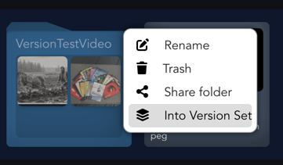
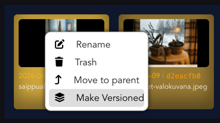
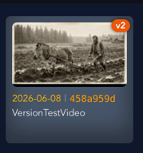
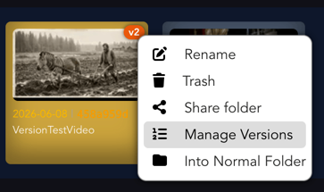
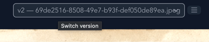

# Version Sets

A **Version Set** lets you keep several revisions of the same media file together and
present them as a single item. The set shows up like one media file (with a version
badge such as `v2`), but holds all its versions inside. Viewers can switch between
versions from a dropdown in the player, and one version is marked **active** — that's
the one shown on the tile and opened by default.

Version Sets are provided by the `basic_folders` organizer plugin. Under the hood a
Version Set is just a folder flagged as `version_set`; each media file in it is one
version.

> **Numbering:** the newest version is on the left and gets the highest number.
> The badge reads `vN` when the active version is the newest, or `vN of M` when an
> older version is active.

## Creating a Version Set

There are two ways to make one.

**1. Convert an existing folder** — right-click a folder and choose **Into Version Set**.
The folder must contain at least one media file and no subfolders. Its files become the
versions (newest on the left), and the newest becomes the active version.

**2. Group loose media files** — select one or more media files inside a folder,
right-click and choose **Make Versioned**. A new Version Set is created in the same
parent folder, named after the leftmost (newest) file, and the selected files are moved
into it. (You can't include folders in the selection.)

## How it looks afterwards

The Version Set appears as a single tile showing the active version's thumbnail, with an
orange version badge in the corner.

## Managing versions

Right-click the Version Set tile to get its commands:

- **Manage Versions** — open the set as a folder to see every version. Inside, the
  active version is tinted cyan. Add versions by moving media files in, remove them by
  moving them out, and reorder them to renumber (newest = leftmost). Right-click any
  version and choose **Set Active Version** to change which one is active.
- **Into Normal Folder** — turn the set back into a plain folder. All media files and
  their order are kept; only the version-set behavior is removed.

Housekeeping is automatic: if you move out the last version the empty set is deleted,
and if the active version is removed the newest remaining one takes over.

## Switching versions in the player

Open a Version Set to play its active version. The player header shows a **Switch
version** dropdown listing every version as `vN — <filename>`, newest first. Picking
another version plays it (keeping your current playback position) and makes it the
set's active version.

