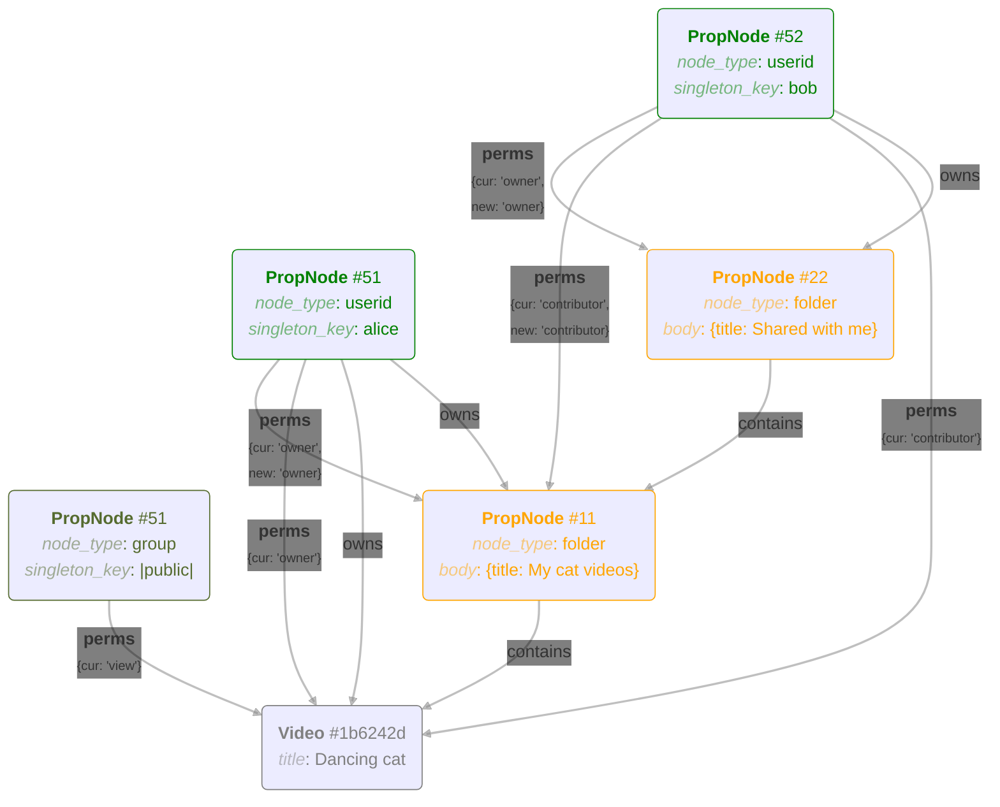

# DAC design for the default Organizer

This outlines the design for access control in the default/example Clapshot Organizer.

- Videos, folders, user ids, and group ids are all represented as nodes in a graph database (sqlite tables `PropNodes` and `PropEdges`).
- Permissions are represented as edges from a user/group node **S** to a video/folder node **A**, with the edge type being `perms`.
- The body of the edge contains a dictionary: `{cur: '<role>', new: '<role>'}`. Each user/group can only have one `perms` edge per video/folder.
  - `cur` specifies permissions for the current video/folder **A**.
  - `new` specifies the default role for user/group **S** on new items added to folder **A**. This entry is only present on edges pointing to folders, not videos.

## Roles and Permissions

The possible roles and their corresponding permissions are:

| Role        | Grants |
|-------------|--------|
| admin       | `view` `add` `comment` `modify` `share` `own` |
| manager     | `view` `add` `comment` `modify` `share` |
| contributor | `view` `add` `comment` |
| commenter   | `view` `comment`|
| viewer      | `view` |

The permissions and their descriptions are as follows:

| Permission | Description |
|------------|-------------|
| `view` | Lets you see the content of a video or the items inside a folder. |
| `add` | Lets you add new videos to a folder. |
| `comment` | Lets you see and add comments to a video. |
| `modify` | Lets you rename video, remove and move away videos from a folder. |
| `share` | Lets you grant any of your own permissions on a video or folder to another user or group. |
| `own` | Lets you take ownership. This allows you to obtain all other permissions but does not imply them initially. |

Note:

- The owner of a video/folder (specified by unique edge of type `owner`) always has a full set of permissions on it.
- Members of the 'super-admin' group have full permissions on everything.

## Permissions and Operations

The following table shows how permissions allow certain operations to a user **U** or group **G**.
In this context, **S** (subject) is a shorthand for "**U** or **G**, when **U** is a member of **G**".

| Operation | Object 1 | Object 2 | Precondition | Postcondition |
| --- | --- | --- | --- | --- |
| List folder contents | folder **F** |  | `view` ∈ perms(**S**,**F**) |  |
| Playback video | video **V** |  | `view` ∈ perms(**S**,**V**) |  |
| See thumbnail of video in a folder | video **V** | folder **F** | `view` ∈ perms(**S**,**V**) & `view` ∈ perms(**S**,**F**) |  |
| Viode/add comments to a video | video **V** |  | `comment` ∈ perms(**S**,**V**) |  |
| Add new video or subfolder to a folder | video or folder **A** | folder **F** | `add` ∈ perms(**S**,**F**) | owner(**A**) = **U** |
| Remove item from folder | video or folder | folder **F** | `modify` ∈ perms(**S**,**F**) |  |
| Delete comments from video | video **V** |  | owner(**V**) = **U** |  |
| Trash video (unlink from everywhere) | video **V** |  | owner(**V**) = **U** |  |
| Trash folder (unlink from everywhere) | folder **F** |  | owner(**F**) = **U** | Other users' items are moved back to their root folders. |
| Set role of another subject | video or folder **A** | User / Group **T** | `share` ∈ perms(**S**,**A**) & (**S** ≠ **T**) | perms(**T**,**A**) ⊂ perms(**S**,**A**) |
| Take ownership of a video or folder | video or folder **A** |  | `own` ∈ perms(**S**,**A**) | owner(**A**) = **U** |
| Move video or folder to another folder | folder **F1** | folder **F2** | `add_new` ∈ perms(**S**,**F2**) & `modify` ∈ perms(**S**,**F1**) |  |
| Rename video or folder | video or folder **A** |  | `modify` ∈ perms(**S**,**A**) |  |
| Take ownership of a video or folder | video or folder **A** |  | `own` ∈ perms(**U**,**A**) | owner(**A**) = **U** |

## Groups

Groups are **not** collection of users within the graph, but rather like "external membership functions".
Like user IDs in Clapshot, they are externally defined and can be implemented with LDAP and similar external lookups.

All permissions a user receives, from groups or user-specific grants, add up -- there are now "deny" rules.

## Permission graph example

As discussed above, users, groups and folders are represented by `PropNodes` table rows in the database. A videos is a row of `Videos` table.
Permissions, who owns what, and what's inside a folder are rows in the `PropEdge` table.

In this example, 
- Alice has folder "My cat videos", which is shared to Bob.
- Bob sees it inside his folder "Shared with me". He can comment on the video and add new videos and folders to Alice's folder.
- Alice has also shared the "Dancing cat" video with anyone who has a link to it. Unlike Bob however, they won't see other videos in her "My cat videos" folder, and won't be able to comment on the video.

